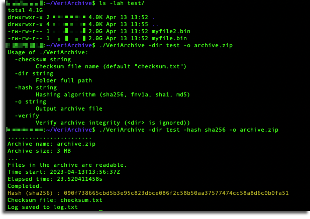
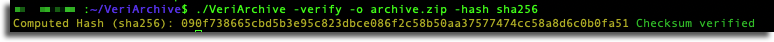

# VeriArchive
 Archive contents and create a checksum hash for us to verify contents

<pre> Usage of ./VeriArchive:

  -checksum string
        Checksum file name (default "checksum.txt")

  -dir string
        Folder full path

  -hash string
        Hashing algorithm (sha256, fnv1a, sha1, md5)

  -o string
        Output archive file

  -verify
        Verify archive integrity (< dir > is ignored))
</pre>
